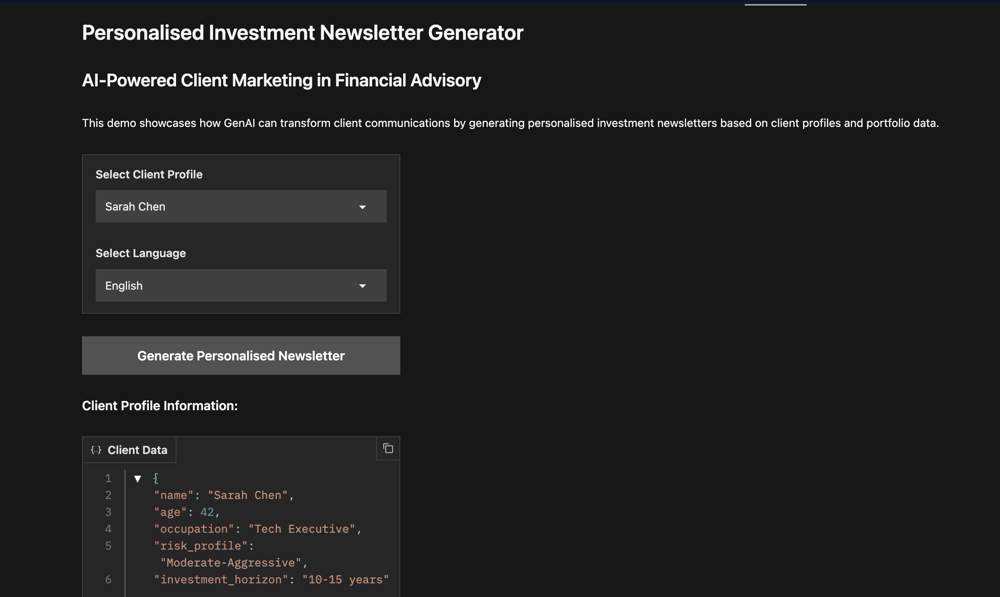

# Personalised-Investment-Newsletter-Generator
An intelligent application that generates personalized investment newsletters for financial advisory clients based on their portfolio data, investment goals, and risk profiles. This project demonstrates how generative AI can transform client communications in wealth management by delivering customised, data-rich content at scale.

# AI-Powered Investment Newsletter Generator



## Project Overview

An intelligent application that generates personalized investment newsletters for financial advisory clients based on their portfolio data, investment goals, and risk profiles. This project demonstrates how generative AI can transform client communications in wealth management by delivering customized, data-rich content at scale.

[➡️ App on Hugging Face Spaces](https://huggingface.co/spaces/Jade-E/personalised-financial-newsletter-generator)

## Key Features

- **Client-Specific Content Generation**: Creates tailored financial insights aligned with client investment goals
- **Dynamic Portfolio Visualization**: Automatically generates visual representations of portfolio allocation and performance
- **Multilingual Support**: Delivers newsletters in English, Spanish, and Mandarin
- **Market Analysis**: Provides sector-specific performance data and outlook
- **Responsive Design**: Professional newsletter layout optimized for various devices

## Technologies Used

- **Python**: Core programming language
- **Gradio**: Interactive UI framework for the application
- **Matplotlib**: Data visualization for portfolio charts
- **Hugging Face Transformers**: Text generation using pre-trained language models
- **Base64 Encoding**: Image conversion for HTML embedding
- **NumPy**: Mathematical operations and data manipulation

## Getting Started

### Prerequisites

```bash
pip install gradio matplotlib numpy pillow transformers
```
Running Locally

Clone this repository:
```
git clone https://github.com/JadeEmm/investment-newsletter-generator.git
cd investment-newsletter-generator
```
Run the application:
```
python app.py
```
Open your browser and navigate to the URL displayed in the terminal (typically http://127.0.0.1:7860)

## Use Cases in Wealth Management

Client Engagement: Deliver personalized insights that demonstrate deep understanding of client needs
Advisor Efficiency: Automate content creation without sacrificing personalization
Marketing Automation: Scale premium content experience to clients at all asset levels
Client Education: Provide relevant market context for client investment decisions
International Client Support: Bridge language barriers with accurate financial translations


## System Design Plan 

Note: The current demo MVP does not have all these features/functionalities built yet.

- Data Input Layer: Client profiles and portfolio information
- AI Processing Layer: Natural language generation and content customisation
- Visualization Engine: Dynamic chart generation based on portfolio data
- Output Formatting: HTML newsletter template with responsive design
- Delivery System: Interface for previewing and distributing newsletters

## Ideas for Future Enhancements

- Integration with live market data APIs
- Compliance checking for financial regulatory requirements
- Email distribution capabilities
- Expanded language support
- Custom template design options
- PDF export functionality

## Contributing
Contributions are welcome! Please feel free to submit a Pull Request.

##License
This project is licensed under the MIT License - see the LICENSE file for details.

## Acknowledgements

Hugging Face for hosting and ML tools
Gradio for the interface framework
Matplotlib for data visualization capabilities
